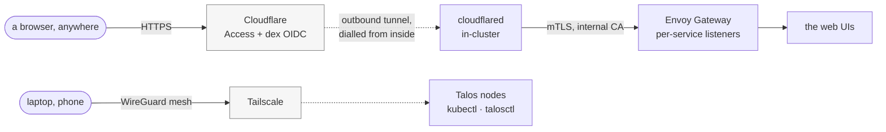

# Getting in from outside

Two paths, deliberately separate, with different credentials and different
failure modes: **a tunnel for other people's browsers**, and **a private
network for administration**. Neither involves an open port.

## The tunnel

**No open ports, no public IP, no port forwarding — ever.** A `cloudflared`
process inside the cluster dials *out* to Cloudflare and holds the connection
open. Inbound HTTP arrives down that tunnel. There is nothing listening on the
router's WAN side for any of it, so there is nothing to scan, and the ISP's
double NAT stops being an obstacle rather than being worked around.

Everything the tunnel carries lands on one origin: the **Envoy Gateway** fleet.
Each service gets its own gateway and route, with listeners selected by SNI,
and `cloudflared` verifies that origin against the internal certificate
authority — not `noTLSVerify`, which is the usual shortcut and throws away the
only thing protecting the last hop.

The zone `excavador.xyz` is dedicated to the cluster, and its DNS records and
tunnel ingress rules are declared in Pulumi. The ingress rules are the
allowlist: a hostname that is not in them is not routed, whatever DNS says.

### Authentication happens at the edge

Every web UI sits behind **Cloudflare Access**, and behind that, **dex** as the
single OIDC issuer with Google as the directory. An application that has no
login of its own is still not reachable without one, because the check happens
before the request reaches it.

That is the point of doing it at the gateway rather than in each app: the
weakest application does not set the floor.

## The admin plane

`kubectl` and `talosctl` never go through the tunnel.

The Talos nodes carry a Tailscale extension and join a personal tailnet, which
puts the Kubernetes and Talos APIs on a private mesh reachable from my own
devices and nothing else. On the LAN those APIs answer normally; from the
internet they do not exist.

**Why not put them behind the tunnel too?** Because the two jobs are not alike.
A tunnel is for handing a web page to a browser that might belong to anyone,
and it depends on a third party being up. Administration needs to work when
that is exactly what is broken — including when the thing being fixed is the
cluster that runs `cloudflared`. Putting both on the same path makes the
recovery tool depend on the thing it is recovering.

## And when both are gone

There is a physically separate jack on the router, on its own subnet, that is
never routed anywhere. It exists for the day the network is broken badly enough
that neither of the paths above answers — the one case a remote-access design
cannot solve for itself.

There is also a temporary route from the house LAN into the hive for
maintenance. It ships disabled; opening it arms a one-shot timer on the router
that closes it again a few hours later and removes itself. Temporary by
construction, rather than by someone remembering.
