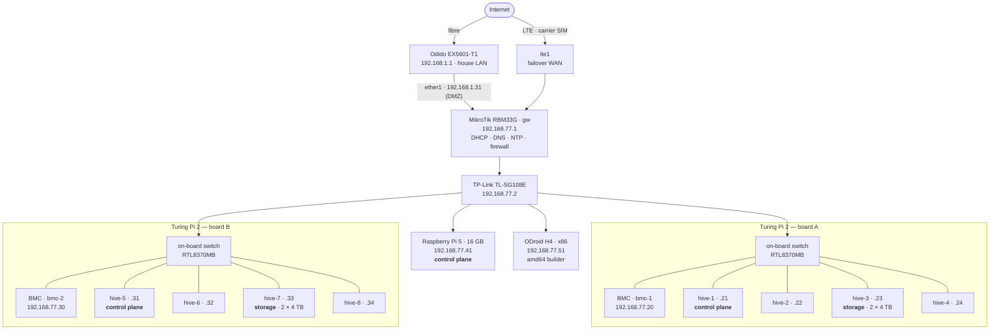

# The machines, and the network they sit on

Ten Kubernetes nodes, two of which are not really machines in their own right
so much as four-in-a-box: a **Turing Pi 2** is a mini-ITX board that takes four
compute modules, wires them to an on-board gigabit switch, and puts a small
management controller in front of them.

Two of those boards give eight modules. A Raspberry Pi 5 and an x86 mini-PC
make ten.

The compute modules are **Turing RK1s** — Rockchip RK3588, 32 GB, NVMe
underneath each one. The two marked *storage* also carry a pair of 4 TB 2.5"
drives in a mirror.

## Why the control plane is where it is

Three control-plane nodes, one on each board and one on the Pi 5. That is the
only placement that survives losing a whole board — and a board is a real
failure domain, not a theoretical one: it has one power input, one on-board
switch, and one management controller. Two control-plane nodes on board A and
one on board B would look like three until the day board A goes away.

The Pi 5 is the third domain precisely because it shares nothing with either
board: its own power supply, its own cable, its own silicon.

## The management controllers

Each board's BMC is a separate little computer that never stops: it owns the
power rails, the USB multiplexer, and a serial console to each module. It is
how a module gets flashed, power-cycled or watched through a boot, without
anyone standing next to it.

Both boards run [a fork of that firmware](https://turingpi.xyz) — the stock one
is dormant — and both are on the same version, updated over the air.

## Addressing

`192.168.77.0/24`, behind the router, double-NATted behind the ISP box. Nothing
in it is reachable from the internet.

| range | what |
| --- | --- |
| `.1` | the router — gateway, DNS, NTP, DHCP |
| `.2` | the switch's management address |
| `.10` | the Kubernetes API, a virtual address that follows the leader |
| `.20`, `.30` | the two board management controllers |
| `.21`–`.24` | board A's four modules |
| `.31`–`.34` | board B's four modules |
| `.41`, `.51` | the Pi 5 and the x86 builder |
| `.100`–`.149` | addresses Cilium hands to LoadBalancer services |
| `.200`–`.219` | DHCP, for whatever is on the bench |

`10/8` was avoided because it collides with the cluster's own pod and service
ranges *and* with the carrier's LTE addressing; `172.16/12` because Docker
helps itself to part of it on another machine here.

**Cluster nodes hold their addresses in their own machine configuration, not in
a DHCP lease.** The router has matching reservations, but only as a backstop.
Cluster identity should not depend on any one box being up — including ours.

## DNS, in two halves

`haarlem.lan` is the router's own static zone: the gateway, the switch, the
management controllers, the nodes. Hand-maintained, because those names change
about once a year.

`haarlem.private` belongs to the cluster. A small CoreDNS in the cluster reads
LoadBalancer services straight from the Kubernetes API and answers
`<service>.<namespace>.haarlem.private`; the router delegates the whole
sub-zone to it with a single forward record.

That split matters more than it looks. The obvious alternative — let a
controller in the cluster write records into the router over its API — means
handing a workload credentials to reconfigure the network it runs on. One
static delegation costs nothing and the cluster gets to own its own names.

Upstream resolution is DNS-over-HTTPS, so neither the ISP nor the mobile
carrier sees the queries.

## Two ways out

The fibre is primary. An LTE SIM in the router is the standby, and failover is
driven by *reaching the internet*, not by the link being up — the router keeps
a route to a probe address and watches that. A dead fibre behind a perfectly
healthy ISP box still fails over, which is the case a link-state check misses.

The probe target is deliberately not the DNS resolver. Pinning the resolver's
address to a dead gateway would take out DNS at exactly the moment failover
needs to work.

## Time

The router is the estate's NTP server. Every node syncs to one stable address
that keeps working during a WAN outage — and Kubernetes, etcd and certificate
validation all care a great deal about clocks agreeing.

## The firewall, briefly

Written from scratch; the router ships with none. The posture is
default-drop inbound on both WAN faces: established and related traffic, the
hive's own subnet, and the breakglass jack are accepted, and everything else is
dropped.

There is no port forwarding to anything in the hive, and no service in it is
published by opening a port. How things are reached from outside is
[a separate design](access.md), and it does not involve inbound ports at all.
